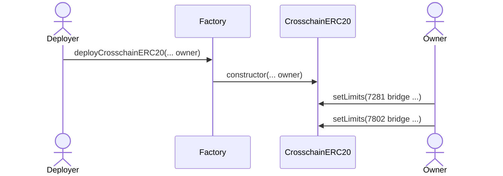
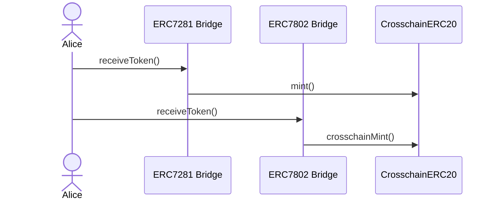
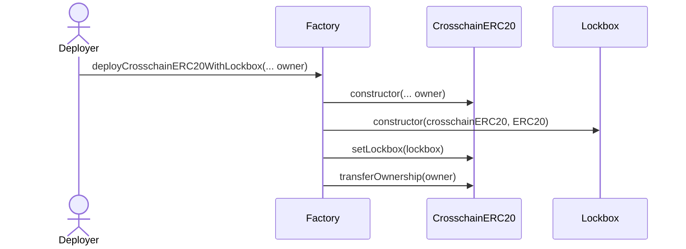
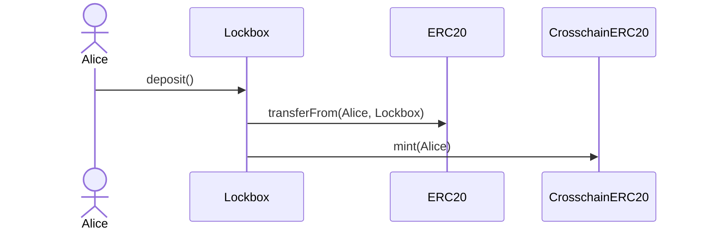
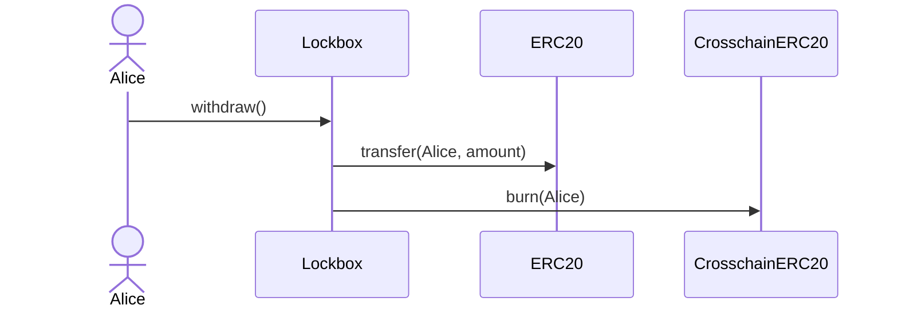
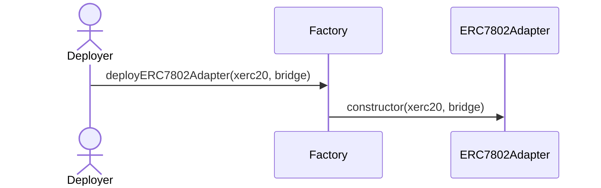
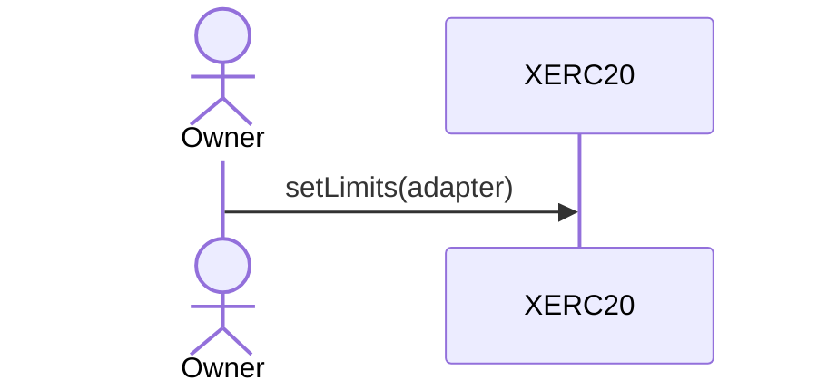
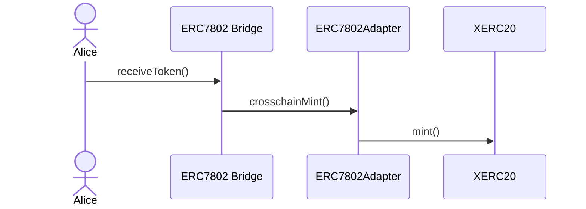

# CrosschainERC20

`CrosschainERC20` is a token implementation that combines [`ERC-7281`](https://ethereum-magicians.org/t/erc-7281-sovereign-bridged-tokens/14979) and [`ERC-7802`](https://ethereum-magicians.org/t/erc-7802-crosschain-token-interface/21508) functionality. This allows tokens to be immediately usable with existing bridge infrastructure while being compatible with the Superchain interop cluster.

### Contracts

_CrosschainERC20_: A token implementation that extends XERC20 and implements the ERC7802 interface. This allows it to interact with both ERC7281-compatible bridges and ERC7802-compatible bridges, providing unified cross-chain fungibility across any bridge type.

_ERC7802Adapter_: An adapter contract that provides ERC7802 functionality for existing xERC20 tokens. It acts as an intermediary layer allowing bridges that implement ERC7802 to interact with xERC20 tokens that don't natively support this interface.

_CrosschainERC20Factory_: The factory is used as a helper to deploy CrosschainERC20 tokens and related contracts. It allows the user to deploy the CrosschainERC20, XERC20Lockbox (with different setup to mint CrosschainERC20 tokens), and ERC7802Adapter in a convenient way while keeping deterministic addresses across chains.

### Flows

The starting point for each flow is the `CrosschainERC20Factory`.

---

For tokens that have not yet been deployed and need to be compatible with both ERC7281 and ERC7802, we recommend implementing CrosschainERC20 from scratch.

The flow starts with the `deployCrosschainERC20()` function.

#### Deploy and Setup CrosschainERC20

Deploys a new `CrosschainERC20` token and sets the owner. Bridges limits can be set on the `deployCrosschainERC20()` function or after the deployment by the owner using the `setLimits()` function.



#### CrosschainERC20 Usage




---

For tokens that are already deployed and cannot be upgraded, we propose using a Lockbox mechanism.

The flow starts with the `deployCrosschainERC20WithLockbox()` function.

#### Deploy and setup CrosschainERC20Lockbox

Deploys a new `CrosschainERC20` paired with a `Lockbox`. The lockbox will mint the `CrosschainERC20` tokens when the user deposits ERC20 tokens and burn them when the user withdraws. The lockbox can not be set to a different address after the deployment.



#### Lockbox Usage





---

For tokens that are already deployed as xERC20 and cannot be upgraded to implement ERC-7802, we propose using an adapter.

The flow starts with the `deployERC7802Adapter()` function.

#### Deploy and setup ERC7802Adapter

Deploys a new `ERC7802Adapter` paired with a `CrosschainERC20`. The adapter will act as an intermediary layer allowing bridges that implement `ERC7802` to interact with `CrosschainERC20` tokens that don't natively support this interface.





#### Adapter Usage




## Setup

1. Install Foundry by following the instructions from [their repository](https://github.com/foundry-rs/foundry#installation).
2. Copy the `.env.example` file to `.env` and fill in the variables
3. Install the dependencies by running : `yarn install && forge install`

## Build

The default way to build the code is suboptimal but fast, you can run it via:

```bash
yarn build
```

In order to build a more optimized code ([via IR](https://docs.soliditylang.org/en/v0.8.15/ir-breaking-changes.html#solidity-ir-based-codegen-changes)), run:

```bash
yarn build:optimized
```

## Running tests

Unit tests should be isolated from any externalities, while E2E usually run in a fork of the blockchain.

```bash
yarn test
```

## Licensing

The primary license for CrosschainERC20 is MIT, see [LICENSE](./LICENSE).
