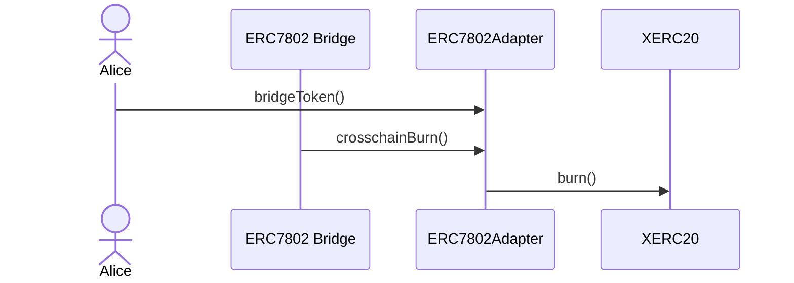

# CrosschainERC20

`CrosschainERC20` is a token implementation that combines [`ERC-7281`](https://ethereum-magicians.org/t/erc-7281-sovereign-bridged-tokens/14979) and [`ERC-7802`](https://ethereum-magicians.org/t/erc-7802-crosschain-token-interface/21508) functionality. This allows tokens to be immediately usable with existing bridge infrastructure while being compatible with the Superchain interop cluster.

### Contracts

_CrosschainERC20_: A token implementation that extends XERC20 and implements the ERC7802 interface. This allows it to interact with both ERC-7281-compatible bridges and ERC7802-compatible bridges, providing unified cross-chain fungibility across any bridge type.

_ERC7802Adapter_: An adapter contract that provides ERC7802 functionality for existing xERC20 tokens. It acts as an intermediary layer allowing bridges that implement ERC7802 to interact with xERC20 tokens that don't natively support this interface.

_CrosschainERC20Factory_: The factory is used as a helper to deploy CrosschainERC20 tokens and related contracts. It allows the user to deploy the CrosschainERC20, XERC20Lockbox (with different setup to mint CrosschainERC20 tokens), and ERC7802Adapter in a convenient way while keeping deterministic addresses across chains.

### Flows

#### Deploy and Setup CrosschainERC20


#### CrosschainERC20 Usage


#### Deploy and setup CrosschainERC20Lockbox


#### Lockbox Usage


#### Deploy and setup ERC7802Adapter


#### Adapter Usage




## Setup

1. Install Foundry by following the instructions from [their repository](https://github.com/foundry-rs/foundry#installation).
2. Copy the `.env.example` file to `.env` and fill in the variables
3. Install the dependencies by running : `yarn install && forge install`

## Build

The default way to build the code is suboptimal but fast, you can run it via:

```bash
yarn build
```

In order to build a more optimized code ([via IR](https://docs.soliditylang.org/en/v0.8.15/ir-breaking-changes.html#solidity-ir-based-codegen-changes)), run:

```bash
yarn build:optimized
```

## Running tests

Unit tests should be isolated from any externalities, while E2E usually run in a fork of the blockchain.

```bash
yarn test
```

## Licensing

The primary license for xERC20 is MIT, see [LICENSE](./LICENSE).
